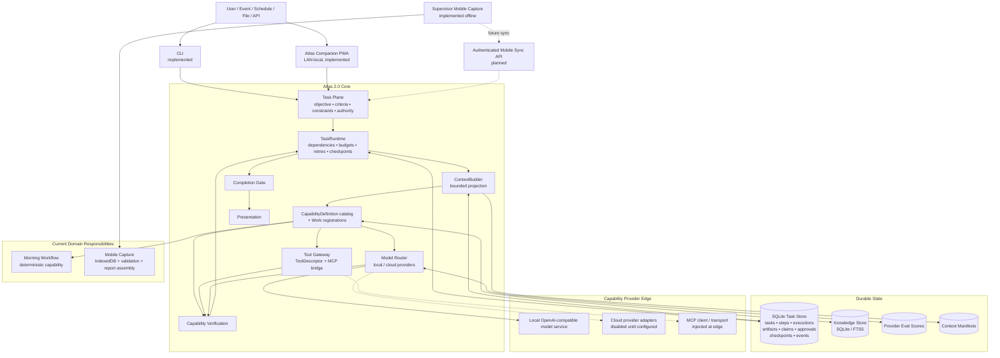
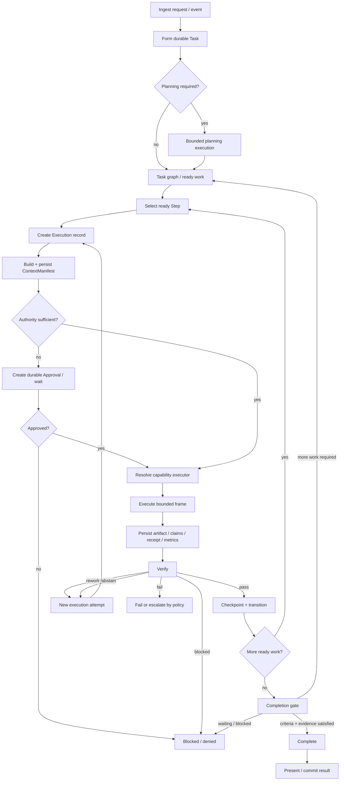

# Atlas Architecture — Runtime and Topology v1.0

**Status:** Canonical Atlas 2.0 architecture  
**Scope:** General runtime, capability boundaries, durable state and current interface/deployment edges

This document defines the current Atlas 2.0 runtime architecture.

It is governed by the Atlas Constitution and implemented by the `atlas_core/` runtime. Domain responsibilities such as Morning Workflow and Mobile Capture retain their own behavioural contracts but integrate through Atlas capability/interface boundaries. Companion is a LAN-local interface into the same runtime, not a second agent.

---

## 1. Product definition

Atlas is one persistent operational agent.

Models, tools, APIs, deterministic programs, parsers, retrieval systems, specialist contexts and cloud services are capabilities Atlas may invoke. They do not become independent Atlas identities and they do not own durable operational state.

The runtime owns objectives, state, evidence, authority, execution history and completion.

Conversation is an interface to Atlas, not the source of truth.

---

## 2. Architectural invariants

1. **One Atlas.** Specialists are bounded capabilities/contexts, not persistent personas.
2. **Tasks are durable.** Substantive work survives model calls, context limits and process restarts.
3. **Task depth is not tool-round depth.** Long work is many bounded execution frames.
4. **Deterministic work stays deterministic.** Calculation, filtering, schema validation, state transitions and known rules prefer ordinary software.
5. **Capability meaning is independent of execution.** `CapabilityDefinition` is identity. `CapabilityExecutionProfile` is this deployment. `CapabilityRegistration` is the Work binding.
6. **Models are providers, not architecture.** Provider selection may change without changing task semantics.
7. **Context is assembled, not accumulated.** Each execution receives a bounded projection of durable state.
8. **State lives outside model context.**
9. **Evidence and claims remain distinguishable.**
10. **Verification precedes completion.**
11. **Authority is explicit and per bounded action.**
12. **Retries create new execution truth.** Previous attempts are not rewritten.
13. **Checkpoints make long work resumable.**
14. **Learning/rules are proposed, not silently installed.**
15. **Complex infrastructure must be earned by a real responsibility.**
16. **Existing domain workflows are capabilities/interfaces, not competing runtimes.**

---

## 3. Canonical topology



### Interpretation

- **ChatRuntime**, **AdvancedRuntime**, and **WorkRuntime** are independent composition roots.
- Chat and Advanced know `CapabilityDefinition` meaning from `catalog()`. They do not execute.
- **WorkRuntime owns execution.** It accepts a Task Brief, then uses `TaskRuntime` as the engine.
- `CapabilityDefinition` is identity. `CapabilityExecutionProfile` is deployment availability. `CapabilityRegistration` is the Work-engine binding.
- The **Model Router sits below capability semantics**.
- The **ContextBuilder owns model/capability context assembly**.
- Durable Work state is not stored in a conversation or model context.
- Mobile Capture is an offline interface/domain surface, not a second Atlas agent.
- Companion remains a LAN-local interface into a legacy `TaskRuntime` assembly. It is not reconnected to the three roots here.
- MCP is an adapter protocol at the tool edge, not Atlas's internal ontology.

---

## 4. Durable object model

### Task

The durable owner of meaningful work:

- objective;
- success criteria;
- constraints;
- authority scope;
- status;
- metadata;
- steps;
- executions;
- artifacts/evidence;
- claims;
- approvals;
- checkpoints;
- event history.

### Success criterion

Each required criterion is independently represented and can remain unresolved until evidence is sufficient.

Completion is impossible while required criteria remain unresolved.

### Step

A bounded unit of task work with:

- dependencies;
- desired capability;
- explicit input artifacts;
- status;
- metadata/criterion mapping.

Independent ready steps may execute in parallel only when their contracts and runtime policy allow it safely.

### Execution

One concrete attempt to satisfy one step:

- capability + exact version;
- provider/tool/handler identity;
- attempt number;
- inputs;
- ContextManifest when applicable;
- outputs;
- verifier result;
- receipt;
- usage/metrics;
- terminal outcome.

Terminal execution truth is:

```text
pass | rework | abstain | fail | blocked
```

A retry creates a new execution row.

### Artifact

An immutable task input or output with content identity and metadata.

Artifacts are the primary durable boundary for capability inputs, outputs and evidence-bearing task material.

### Claim

A durable statement with an epistemic class such as:

```text
observed | retrieved | calculated | inferred | suggested | executed
```

Evidence requirements depend on the claim class.

### Approval

A durable authority decision for one bounded action.

A task may be capable of an action without being authorised to perform it.

### Checkpoint

A durable logical boundary that allows long-running work to resume without depending on process memory.

### ContextManifest

An immutable record of what context was assembled for a bounded capability/model invocation, what was omitted, why, and under which capability version/policy.

---

## 5. Capability ownership

Atlas knows capabilities independently of whether this deployment can execute them.

```text
CapabilityDefinition
        |
        | meaning
        v

CapabilityExecutionProfile
        |
        | deployment
        v

CapabilityRegistration
        |
        | executable Work implementation
        v

TaskRuntime
```

`CapabilityDefinition` (`catalog()` / `lookup()`) is identity:

```text
id
human description
required authority
confirmation (none | required)
side-effect class
```

`CapabilityExecutionProfile` is this deployment:

```text
capability_id
version
executor kind
input schema
output schema / artifact kind
side effects
idempotency
context policy
allowed tools
eligible providers
privacy/data classification
execution/tool/cost budgets
retry policy
parallel safety
verifier
binding
deprecation / replacement
```

`CapabilityRegistration` binds definition + profile + handler for Work. `TaskRuntime` executes that registration. Handler registration, MCP discovery, and ToolGateway do not create catalog identity.

Executor kinds include deterministic code, tools, model-backed work, composite responsibilities and human gates.

Definitions describe **what Atlas understands**. Profiles describe **whether this deployment can perform it**. Providers/tools describe **how that responsibility is satisfied**.

---

## 6. Runtime lifecycle



The execution row exists before the handler/model/tool call. Interrupted work is therefore visible rather than disappearing into process memory.

Idempotent interrupted work may be explicitly recovered into another attempt. Non-idempotent external work fails closed when external state may be unknown.

---

## 7. Execution depth and budgets

Atlas does not use an arbitrary conversational `max_tool_rounds` as the definition of task depth.

The runtime uses bounded execution frames with resource ceilings. Current `RuntimeBudget` supports:

- `max_executions`;
- `max_cycles`;
- `max_model_calls`;
- `max_parallel_workers`;
- optional `max_cost_usd`.

These are ceilings, not quotas. A task that is complete after four executions should stop after four even if its budget allows hundreds.

Provider failover or escalation does not reset task history.

---

## 8. Context topology

Contexts such as planning, reasoning, review or presentation are operating profiles, not agents.

Capability and presentation are separate. The capability used for a step (for example `reasoning.general`) does not by itself choose the user-facing profile. ContextBuilder selects a presentation profile from the task objective:

- casual conversation → conversational reply;
- factual Q&A → concise direct answer;
- analysis or high-stakes claims → Evidence / Uncertainty / Inference;
- explicitly requested deep analysis → full research profile;
- narrative/artifact requests → compose.

Ordinary questions must not receive a research report merely because the executing capability defaults to research.

For each model/capability execution Atlas builds a fresh bounded projection from durable state.

The ContextBuilder is the only component authorised to assemble task facts into model/capability context.

The ContextManifest records:

- task/step/execution identity;
- capability ID/version;
- budget/policy;
- included material;
- dropped material and reasons;
- estimates/accounting;
- rework linkage where applicable;
- immutable content hash.

Provider adapters may translate this projection into provider-specific wire format but may not invent hidden task context.

**The context window is a workspace, not a database.**

---

## 9. Verification topology

Verification is capability-specific and deterministic where possible.

Examples:

- Morning pack → required output structure and acceptance suite;
- knowledge ingestion → durable chunks + provenance;
- coding → tests/static checks/diff review;
- external communication → provider receipt/message identity;
- analytical work → evidence-grounding/contract checks.

Task completion is an independent gate over accepted evidence and success criteria.

---

## 10. Model/provider topology

Model providers live beneath intelligence capabilities.

The current provider layer supports configuration for:

- local/OpenAI-compatible chat endpoints;
- OpenAI Responses-style providers;
- Anthropic Messages-style providers;
- Gemini Generate Content-style providers;
- other OpenAI-compatible gateways.

Cloud providers are disabled until explicitly configured with credentials/current model IDs. Companion stores xAI credentials outside provider JSON, can select a live model, and treats an enabled cloud provider as the sole active brain. Local GPU inference loads one model at a time. Secrets must not appear in overlay JSON or health identity.

Routing can consider:

- capability eligibility;
- Atlas eval score;
- privacy/local-only requirements;
- allowlists;
- context capacity;
- priority;
- latency rank;
- configured cost information.

Provider identity is configuration, not business logic.

---

## 11. Evals

Atlas includes a capability evaluation harness with repeated attempts and reliability measures such as:

- `pass@1`;
- `pass@k`;
- `pass^k`.

Measured provider/capability scores persist in SQLite and can override neutral eligibility seeds in routing.

Models therefore earn roles through Atlas-specific measured performance rather than fixed prestige or parameter count.

---

## 12. Local knowledge and retrieval

Atlas currently uses SQLite-first knowledge storage.

`knowledge.ingest_text` persists chunked text with hashes and provenance. `knowledge.search` returns source-grounded matches through the same capability/artifact runtime.

FTS5 is used when available with a deterministic SQLite fallback.

Semantic/vector retrieval is deliberately deferred until retrieval evals demonstrate a need.

If introduced later, it must implement the same retrieval/evidence boundary rather than becoming a second memory architecture.

---

## 13. Tool and MCP boundary

Native tools, APIs and MCP-exposed tools pass through the normalized Tool Gateway.

Side-effecting tool success requires a durable receipt.

MCP remains an edge adapter:

```text
Capability
   ↓
Tool Gateway
   ├── native tool
   ├── API
   ├── CLI
   └── MCP bridge
```

The runtime does not assume one MCP transport or a permanent fleet of MCP servers.

---

## 14. Authority and safety

Authority levels are monotonic:

```text
read
  → interpret
  → recommend
  → modify_internal
  → communicate
  → execute_external
```

A capability declares the minimum authority it needs.

Insufficient authority creates a durable approval request and pauses the bounded step.

Approval does not globally elevate the task.

Non-idempotent side effects are not automatically retried.

---

## 15. Events and observability

Runtime lifecycle events are persisted and may also be published to an in-process event bus.

Examples:

```text
task.started
task.paused
task.resumed
task.completed
task.failed
capability.started
capability.completed
verification.completed
approval.requested
approval.applied
retry.blocked
```

Audit, notifications, cost accounting and future telemetry may consume these events without becoming orchestration logic.

---

## 16. Current implementation layout

```text
atlas_core/
├── tasks/                 durable runtime records and SQLite stores
├── capabilities/          CapabilityDefinition catalog, profiles, Work registry
├── chat/                  ChatRuntime composition root
├── advanced/              AdvancedRuntime composition root
├── work/                  WorkRuntime composition root
├── providers/             provider contracts, routing, adapters, eval scores
├── knowledge/             SQLite/FTS ingestion and retrieval
├── integrations/          domain capability adapters
├── authority.py           authority ladder and decisions
├── context.py             ContextBuilder + ContextManifest
├── deliverable.py         deliverable contract + presentation profile
├── runtime.py             TaskRuntime public facade
├── runtime_types.py       RuntimeBudget / result types
├── runtime_lifecycle.py   task lifecycle / recovery coordination
├── runtime_execution.py   bounded execution mechanics
├── runtime_finish.py      verification / completion transitions
├── verification.py        capability and completion verification
├── planner.py             durable planning → task graph
├── presentation.py        evidence-backed result presentation
├── tools.py               Tool Gateway + MCP bridge
├── evals.py               capability reliability harness
├── events.py              event fan-out
├── schema_validation.py   contract schema enforcement
├── bootstrap.py           runtime assembly
└── __main__.py            CLI

atlas_companion/           LAN-local Companion PWA
atlas_morning/             deterministic Morning Workflow
atlas_mobile/              offline-first Mobile Capture PWA
```

---

## 17. Existing domain responsibilities

### Morning Workflow

The frozen TMM Morning Workflow is exposed through:

```text
operations.morning_pack.generate
```

Atlas TaskRuntime owns the task/execution/evidence shell while the domain specification owns conservative reporting meaning.

### Mobile Capture

`atlas_mobile/` provides the implemented offline-first supervisor reporting surface:

- activity-at-a-time capture;
- deterministic validation;
- IndexedDB persistence;
- service-worker shell;
- End Report assembly;
- WhatsApp-ready text;
- phone-offline acceptance.

Authenticated server sync is not yet implemented.

### Companion PWA

`atlas_companion/` is the implemented LAN-local owner/admin interface. Ask, Work, Knowledge, Models and Settings enter TaskRuntime. Personal and notifications remain stubs. The adapter is unauthenticated and must stay on localhost or a trusted LAN.

---

## 18. External/deployment boundaries

The core runtime is implemented without pretending every external surface is already configured.

Still edge/future work:

- production always-on server packaging;
- authentication/authorization for remote Companion access;
- authenticated Mobile Capture synchronization;
- server-to-phone bootstrap state;
- host-resource management capabilities;
- semantic/vector retrieval if justified by evals;
- Personal connectors and async Ask so long work does not block HTTP.

These should attach to the stable task/capability runtime rather than redefine it.

---

## 19. Validation requirements

Architecture is considered implemented only where regression behaviour supports it.

The repository test suite covers the current runtime invariants including durable state, dependency readiness, immutable artifacts/executions, authority gates, context manifests, schema enforcement, provider routing, side-effect receipts, deep task execution, Morning Workflow behaviour and Mobile Capture fixtures.

CI runs:

```bash
uv sync --frozen
uv run python -W error::ResourceWarning -m unittest discover -s tests -q
uv run python -m compileall -q atlas_core atlas_morning tests
node atlas_mobile/run_fixtures.js
```

---

## 20. Deliberate non-goals

Atlas 2.0 is intentionally not built around:

- persistent named agent swarms;
- a giant system prompt carrying system truth;
- a permanent fixed Reasoning Mesh;
- arbitrary conversational tool-round limits defining task completion;
- a vector database before retrieval evals justify it;
- a permanent broad MCP fleet;
- Kubernetes/Kafka/microservices added speculatively;
- Temporal/Celery merely to claim durability;
- silent self-learning rules;
- automatic high-consequence authority;
- a browser UI that defines runtime truth.

---

## 21. North star

> **Atlas is a local-first persistent operational agent whose durable runtime owns objectives, state, evidence, authority and completion, and dynamically assembles deterministic capabilities, tools and benchmarked local or cloud intelligence into bounded verified execution frames.**

The resident model is not Atlas. A cloud expert is not Atlas. The Morning Workflow is not Atlas. Companion is not Atlas. The mobile app is not Atlas.

**Atlas is the persistent system that owns the work.**
