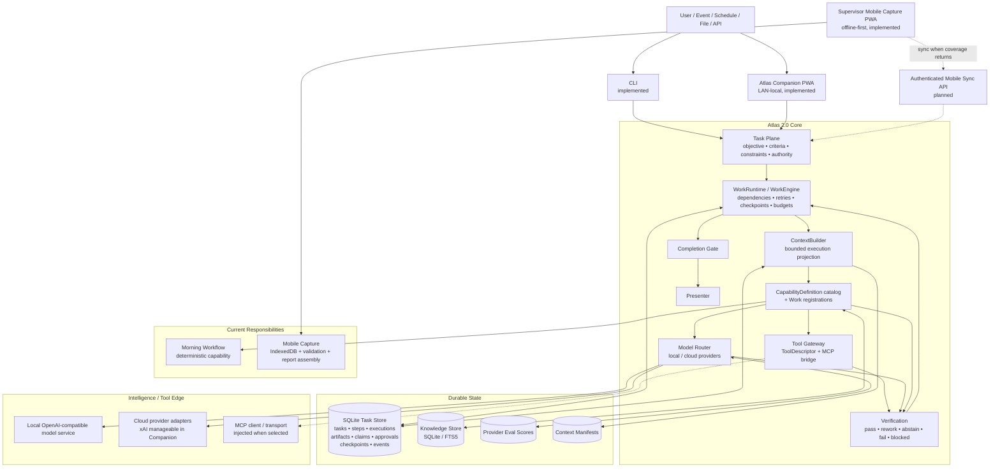
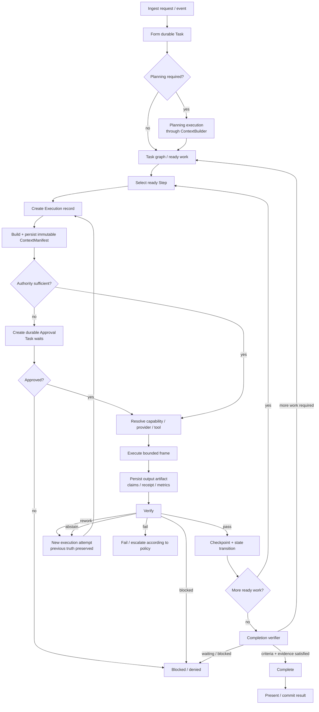
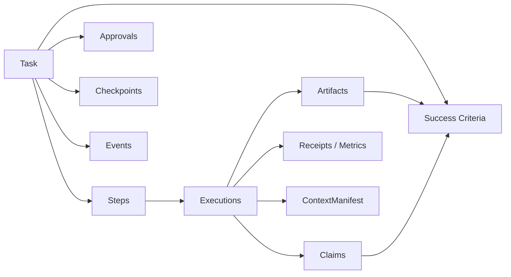
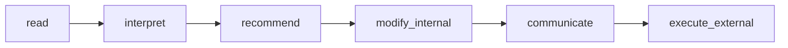
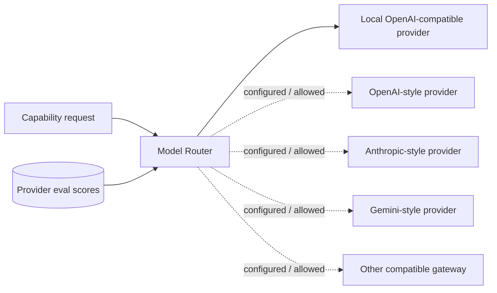
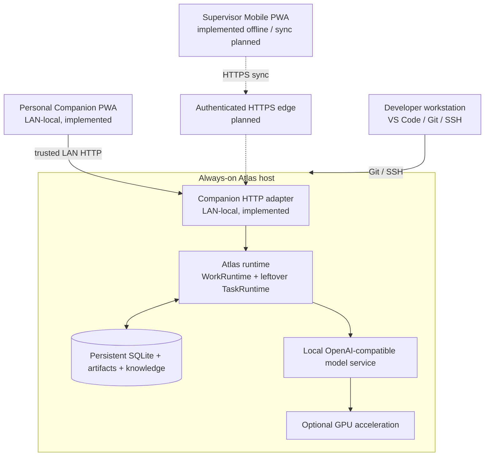

# Atlas 2.0

> **One persistent operational agent. Durable tasks, explicit authority, evidence-backed execution, deterministic work where possible, and model intelligence where it is actually useful.**

Atlas is a local-first operational agent runtime. It is designed to own meaningful work over time rather than behave as a thin chat wrapper around an LLM.

Models, tools, APIs, parsers, retrieval systems, deterministic programs, specialist contexts and external services are **capabilities Atlas may invoke**. They are not separate Atlas identities and they do not own durable operational state.

The runtime owns the objective, task state, evidence, authority, execution history and completion criteria. Conversation is one possible interface into Atlas; it is not the source of truth.

---

## Status

Atlas 2.0 is under active development. The durable runtime and core governance contracts are implemented on `main`; several external interfaces and deployment pieces remain intentionally separate edge work.

| Area | Current state |
|---|---|
| Durable WorkRuntime / WorkEngine | **Implemented** |
| SQLite task / step / execution state | **Implemented** |
| CapabilityDefinition catalog + execution profiles | **Implemented** |
| ContextBuilder + immutable ContextManifest | **Implemented** |
| Verification and completion gates | **Implemented** |
| Explicit authority / approvals | **Implemented** |
| Tool Gateway + MCP bridge contract | **Implemented** |
| Local / cloud model provider routing | **Implemented** |
| Provider eval score persistence | **Implemented** |
| SQLite / FTS knowledge plane | **Implemented** |
| Morning Workflow runtime integration | **Implemented** |
| Offline-first Mobile Capture PWA | **Implemented and phone-offline tested** |
| Atlas Companion PWA | **Implemented (LAN-local TaskRuntime interface)** |
| Companion authentication / public bind | **Not yet implemented** |
| Mobile report server sync + authentication | **Not yet implemented** |
| Production always-on server packaging | **Not yet canonicalized** |
| Host resource-management capability | **Direction only** |
| Semantic / vector retrieval | **Deferred until evals justify it** |

The project deliberately avoids presenting planned edge integrations as finished code.

---

## Core idea

Atlas is built around a simple chain:

```text
Task → Capability → Artifact → Verification
```

A model response is not completion. A tool call is not completion. A conversation ending is not completion.

Atlas completes work when durable task state and required evidence satisfy explicit success criteria.

### Architectural invariants

1. **One Atlas.** Specialists are bounded capabilities or contexts, not persistent personas.
2. **Tasks are durable.** Work survives model calls, context limits and process restarts.
3. **Execution depth is not chat/tool-round depth.** Long work is many bounded execution frames.
4. **Deterministic work stays deterministic.** Calculation, filtering, validation, state transitions and known business rules prefer ordinary software.
5. **Capability meaning is independent of execution.** `CapabilityDefinition` is identity. `CapabilityExecutionProfile` is this deployment. `CapabilityRegistration` is the resolved Work binding. `WorkRuntime` owns the work item; `WorkEngine` executes it.
6. **Models are providers, not architecture.** Providers can change without changing task semantics.
7. **Context is assembled, not accumulated.** Each execution receives a fresh bounded projection of durable state.
8. **State lives outside the model context.**
9. **Evidence and derived claims remain distinguishable.**
10. **Verification precedes completion.**
11. **Authority is explicit.** Capability does not imply permission.
12. **Retries preserve previous execution truth.**
13. **Learning is proposed, not silently installed.**
14. **Complex infrastructure must earn its place through real work.**

The governing principles live in [Atlas Constitution](./Atlas%20Constitution.md).

---

# System topology

Solid paths represent implemented runtime relationships. Dashed paths represent planned or injected edge surfaces.



### What the topology means

- **ChatRuntime, AdvancedRuntime, and WorkRuntime are independent composition roots.**
- **Chat and Advanced know capabilities without executing them.** Identity is `catalog()`.
- **WorkRuntime owns execution.** `WorkEngine` executes the accepted contract. Leftover CLI `plan` / Companion still use `TaskRuntime` and are not the Work composition.
- **Capability meaning is independent of deployment.** A catalog capability may have no profile on this host.
- **The model router sits below capabilities.** A capability may be satisfied by different providers without changing the definition.
- **State is structural and durable.** The context window is a workspace, not a database.
- **Mobile and Companion are interfaces, not other agents.** Companion remains a LAN-local TaskRuntime surface and is not reconnected to the three roots here. Mobile Capture is bounded supervisor reporting.
- **MCP is an edge protocol, not Atlas's internal ontology.** Discovery does not create catalog identity.

---

# Runtime lifecycle

Atlas executes substantive work as a durable graph of bounded execution frames.



## Execution truth

A concrete execution ends in one of:

```text
pass | rework | abstain | fail | blocked
```

A retry creates a **new execution record**. Atlas does not rewrite a failed attempt into a successful one.

Interrupted idempotent work can be explicitly recovered. Interrupted non-idempotent side effects fail closed because external state may be unknown.

---

# Execution depth and budgets

Task depth belongs to `WorkRuntime` / `WorkEngine` rather than a conversational Director or arbitrary `max_tool_rounds` limit.

Current runtime budget ceilings include:

```text
max_executions
max_cycles
max_model_calls
max_parallel_workers
max_cost_usd (optional)
```

A ceiling is not a target. Atlas stops as soon as the task is verified complete.

Provider escalation does not erase prior attempts or reset task history.

---

# Durable object model



The durable task is the owner of substantive work. Individual model calls and tool calls are attempts inside that task rather than the task itself.

---

# Capability ownership

Atlas knows capabilities independently of whether this deployment can execute them.

```text
CapabilityDefinition
        |
        | meaning
        v

CapabilityExecutionProfile
        |
        | deployment
        v

CapabilityRegistration
        |
        | resolved Work implementation
        v

WorkRuntime / WorkEngine
```

`CapabilityDefinition` is identity (`catalog()` / `lookup()`): id, description, required authority, confirmation, side-effect class.

`CapabilityExecutionProfile` is this deployment: version, executor kind, schemas, tools, verifier, budgets, binding, retry, privacy.

`CapabilityRegistration` is the resolved Work record. `WorkEngine` executes it. Handler registration, MCP discovery, and ToolGateway do not create catalog identity.

Durable planned steps can pin an exact profile version. Executions record the exact version used.

---

# Context topology

The ContextBuilder is the sole authority for assembling task context for normal capability/model invocation.

```text
Durable task state
        ↓
ContextBuilder
        ↓
immutable ContextManifest
        ↓
bounded provider/capability projection
        ↓
execution
```

Provider adapters may translate the projection into provider wire format but may not add hidden task facts.

Capability and presentation are separate. A step may still execute `reasoning.general` while the assembled profile is a concise answer, a conversational reply, compose, evidence, or full research, depending on intent. Ordinary factual questions do not receive an Evidence / Uncertainty / Inference report merely because the capability defaults to research.

The ContextManifest records included and dropped material, reasons, budget/accounting and capability identity before invocation.

**The context window is a workspace, not a database.**

---

# Authority

Authority levels are monotonic:



A capability can exist without the task being authorised to use it at the required level.

Insufficient authority creates a durable approval and pauses the bounded action.

Approval applies to that action rather than silently elevating the whole task.

---

# Provider topology



Routing can consider capability eligibility, Atlas eval score, privacy, allowlists, context capacity, priority, latency and configured cost information.

Cloud providers are disabled until explicitly configured. Companion can save xAI credentials outside provider JSON, select a model, and enable that provider as the sole active brain. Local GPU slots load one at a time. Secrets never appear in overlay JSON or `/api/health`.

See [`config/runtime-providers.example.json`](./config/runtime-providers.example.json) for the current example registry shape. Host-local overlays such as `config/runtime-providers.local.json` are not committed.

---

# Knowledge and retrieval

Atlas currently uses a SQLite-first knowledge plane.

`knowledge.ingest_text` chunks and persists extracted text with hashes/provenance. `knowledge.search` retrieves source-grounded chunks through the same capability/artifact runtime.

FTS5 is preferred when available with deterministic SQLite fallback.

Semantic/vector retrieval is deliberately deferred until retrieval evals show a real need.

---

# Tools and MCP

Native tools, APIs, CLI adapters and MCP-discovered tools pass through Atlas's normalized tool boundary.

Side-effecting success requires a receipt.

MCP is an adapter, not Atlas ontology:

```text
Capability
   ↓
Tool Gateway
   ├── native Python
   ├── API
   ├── CLI
   └── MCP bridge
```

Transport is selected at the edge rather than embedded in core runtime semantics.

Discovery never equals exposure. MCP-discovered tools remain provider inventory until a `CapabilityDefinition` exists and this deployment supplies a `CapabilityExecutionProfile` that binds them. See [Capability Awareness](./docs/architecture/Capability%20Awareness.md).

---

# Current domain responsibilities

## Morning Workflow

The current TMM Morning Workflow remains a deterministic responsibility exposed as:

```text
operations.morning_pack.generate
```

Atlas 2.0 wraps it through the task/capability/evidence boundary without changing its conservative reporting semantics.

See [Morning Workflow — Behavioural Specification](./Atlas%20Morning%20Workflow%20%E2%80%94%20Behavioural%20Specification.md).

## Mobile Capture

`atlas_mobile/` contains the implemented offline-first supervisor reporting surface:

- activity-at-a-time capture;
- deterministic green/orange/red validation;
- IndexedDB persistence;
- service-worker shell caching;
- End Report assembly;
- WhatsApp-ready plain-text rendering and copy;
- phone-offline acceptance.

Authenticated server synchronization is **not yet implemented**.

See [Mobile Capture V1 — Behavioural Contract](./Mobile%20Capture%20V1%20%E2%80%94%20Behavioural%20Contract.md) and [`atlas_mobile/PHONE-OFFLINE-ACCEPTANCE.md`](./atlas_mobile/PHONE-OFFLINE-ACCEPTANCE.md).

## Companion PWA

`atlas_companion/` is the LAN-local owner/admin interface into the same TaskRuntime. It is one persistent agent with spaces of responsibility, not extra personalities.

| Space | What it is |
|---|---|
| **Ask** | Conversational front door. Infers criteria and authority. Always creates durable work when something must happen. Transcript persists across refresh. |
| **Work** | Overview, one-off, recurring (`metadata.workflow`), history, approvals, hard delete |
| **Personal** | Stub command center (email/calendar/reminders not connected) |
| **Knowledge** | Library, search, indexing. Indexing jobs are Work. |
| **Models** | Local sequential load/unload/activate; xAI credentials, model select, exclusive enable |
| **Settings** | Host health and runtime identity (assembler, pid, enabled providers; no secrets) |

The browser talks only to Companion. Companion talks to TaskRuntime. The browser does not call model-provider endpoints.

This surface is **not authenticated**. Bind it to localhost or a trusted LAN only. It is not a public internet service.

### Run Companion

```bash
uv run python -m atlas_companion.server \
  --db instance/atlas.db \
  --providers config/runtime-providers.local.json \
  --host 127.0.0.1 \
  --port 8787
```

Then open `http://127.0.0.1:8787`. Use a LAN `--host` only on a trusted network.

---

# Current repository layout

```text
atlas-agent/
├── atlas_core/
│   ├── tasks/                durable runtime records and SQLite stores
│   ├── capabilities/         CapabilityDefinition catalog, profiles, Work registry
│   ├── chat/                 ChatRuntime composition root
│   ├── advanced/             AdvancedRuntime composition root
│   ├── work/                 WorkRuntime composition root
│   ├── providers/            provider contracts, routing, adapters, eval scores
│   ├── knowledge/            SQLite / FTS ingestion and retrieval
│   ├── integrations/         domain responsibility adapters
│   ├── authority.py
│   ├── context.py
│   ├── deliverable.py        deliverable contract + presentation profile
│   ├── runtime.py            TaskRuntime public facade
│   ├── runtime_types.py
│   ├── runtime_lifecycle.py
│   ├── runtime_execution.py
│   ├── runtime_finish.py
│   ├── verification.py
│   ├── planner.py
│   ├── presentation.py
│   ├── tools.py
│   ├── evals.py
│   ├── events.py
│   ├── schema_validation.py
│   ├── bootstrap.py
│   └── __main__.py
│
├── atlas_companion/          LAN-local Companion PWA
├── atlas_morning/            frozen Morning Workflow implementation
├── atlas_mobile/             offline-first Mobile Capture PWA
├── config/                   runtime/provider configuration examples
├── docs/architecture/        current runtime governance
├── docs/prototypes/          Companion design prototype
├── tests/                    runtime + behavioural regressions
└── .github/workflows/        CI
```

---

# Quick start

## Requirements

- [uv](https://docs.astral.sh/uv/)
- Python **3.12**, installed and used through uv (`requires-python = ">=3.12,<3.13"`)
- Git
- Node.js if running the Mobile fixture suite
- Optional OpenAI-compatible local model endpoint for planning/model capabilities

## Clone

```bash
git clone https://github.com/Keeladin/atlas-agent.git
cd atlas-agent
```

## Python environment

Install Python 3.12 through uv and sync the locked project environment from `pyproject.toml` and `uv.lock`:

```bash
uv python install 3.12
uv sync --frozen
```

## Validate the checkout

```bash
uv run python -W error::ResourceWarning -m unittest discover -s tests -q
uv run python -m compileall -q atlas_core atlas_morning tests
node atlas_mobile/run_fixtures.js
```

These are the same classes of checks run by GitHub Actions.

## Initialize a runtime database

```bash
mkdir -p instance
uv run python -m atlas_core --db instance/atlas.db tasks
```

---

# CLI

The CLI remains the canonical engineering and recovery interface. Companion is the general LAN-local browser interface. Both enter the same TaskRuntime.

```text
uv run python -m atlas_core [--db PATH] [--providers CONFIG] COMMAND
```

Commands:

```text
morning      Run the Morning Workflow through TaskRuntime
plan         Create a durable task and bounded capability plan
run          Run or resume a durable task
recover      Resolve executions left running by an interrupted process
approve      Approve one pending authority gate
deny         Deny one pending authority gate
result       Render durable task truth as a report
index-text   Index a UTF-8 text file into local knowledge
search       Search local full-text knowledge
cancel       Cancel a non-terminal task
status       Show a task snapshot
tasks        List durable tasks
```

### Index local knowledge

```bash
uv run python -m atlas_core \
  --db instance/atlas.db \
  index-text "Atlas Constitution.md"
```

Search it:

```bash
uv run python -m atlas_core \
  --db instance/atlas.db \
  search "What is Atlas?"
```

### Configure a local model provider

```bash
cp config/runtime-providers.example.json config/runtime-providers.local.json
```

The example resident provider expects an OpenAI-compatible endpoint at:

```text
http://127.0.0.1:1234
```

with model identifier:

```text
atlas
```

Verify the endpoint independently, for example:

```bash
curl http://127.0.0.1:1234/v1/models
```

### Create a planned task

```bash
uv run python -m atlas_core \
  --db instance/atlas.db \
  --providers config/runtime-providers.local.json \
  plan "Explain the purpose of Atlas's durable task runtime" \
  --criterion "Produce a clear evidence-grounded explanation"
```

Then inspect/run/present:

```bash
uv run python -m atlas_core --db instance/atlas.db status <TASK_ID>

uv run python -m atlas_core \
  --db instance/atlas.db \
  --providers config/runtime-providers.local.json \
  run <TASK_ID>

uv run python -m atlas_core --db instance/atlas.db result <TASK_ID>
```

---

# Validation and CI

GitHub Actions currently runs:

```bash
uv sync --frozen
uv run python -W error::ResourceWarning -m unittest discover -s tests -q
uv run python -m compileall -q atlas_core atlas_morning tests
node atlas_mobile/run_fixtures.js
```

Architectural regression requirements include:

- durable state survives database reopen;
- dependency graphs control readiness;
- artifacts remain immutable and hashed;
- retries do not rewrite previous execution truth;
- authority can pause and resume one bounded action;
- capability version pinning survives durable execution;
- catalog identity is independent of handler registration, MCP discovery, and ToolGateway;
- ContextManifest exists before provider/handler invocation;
- ContextManifest cannot be overwritten for an execution;
- bounded context records dropped candidates and reasons;
- tool/capability schemas are enforced;
- side-effect constraints fail closed;
- planning uses ContextBuilder;
- provider routing respects privacy and eval score;
- presentation profile follows intent rather than capability default;
- tasks can execute beyond shallow conversational tool-round ceilings;
- Morning, Mobile, and Companion behavioural suites remain green.

---

# Deliberate non-goals

Atlas 2.0 is intentionally **not** built around:

- persistent named autonomous-agent swarms;
- a giant system prompt carrying operational truth;
- a permanent fixed Reasoning Mesh;
- model-specific business logic;
- a vector database before retrieval evals justify one;
- a permanent broad MCP fleet;
- Kafka, Kubernetes or microservices added speculatively;
- Temporal or Celery merely to claim durable execution depth;
- silent self-learning rules;
- automatic high-consequence authority;
- a web UI that defines runtime truth.

The project prefers the smallest system that reliably owns a real responsibility.

---

# Near-term deployment direction

The runtime is interface-agnostic. Companion already binds the same TaskRuntime on a trusted LAN. Always-on packaging, authentication, and public HTTPS remain deployment work.

**Companion is implemented. Authenticated remote access and production supervision are not.**



The intended property is simple: **the operational Atlas runtime can remain alive even when the development workstation is off.**

---

# Documentation map and precedence

When documents disagree, use this order:

1. [Atlas Constitution](./Atlas%20Constitution.md)
2. [Atlas Architecture — Runtime and Topology](./Atlas%20Architecture%20%E2%80%94%20Runtime%20and%20Topology.md)
3. [Atlas Runtime Governance](./docs/architecture/Atlas%20Runtime%20Governance%20Reconciliation.md)
4. Domain behavioural contracts

Current product/domain references:

- [Atlas Product Definition](./Atlas%20Product%20Definition.md)
- [Atlas Product Direction](./Atlas%20Product%20Direction.md)
- [Morning Workflow — Behavioural Specification](./Atlas%20Morning%20Workflow%20%E2%80%94%20Behavioural%20Specification.md)
- [Mobile Capture V1 — Behavioural Contract](./Mobile%20Capture%20V1%20%E2%80%94%20Behavioural%20Contract.md)
- [Phone Offline Acceptance](./atlas_mobile/PHONE-OFFLINE-ACCEPTANCE.md)

There are intentionally no historical advisory/proposal documents in the canonical documentation chain.

---

# North star

> **Atlas is a local-first persistent operational agent whose durable runtime owns objectives, state, evidence, authority and completion, and dynamically assembles deterministic capabilities, tools and benchmarked local or cloud intelligence into bounded verified execution frames.**

The resident model is not Atlas.

The cloud expert is not Atlas. Companion is not Atlas.

The Morning Workflow is not Atlas.

The mobile app is not Atlas.

**Atlas is the persistent system that owns the work and composes those capabilities to remove recurring friction.**
