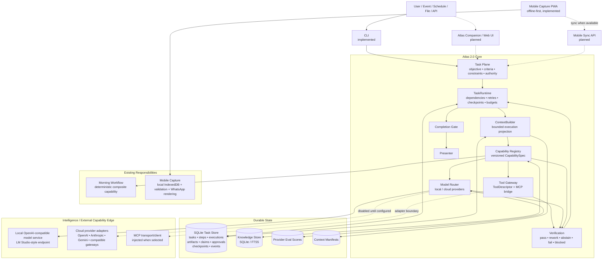
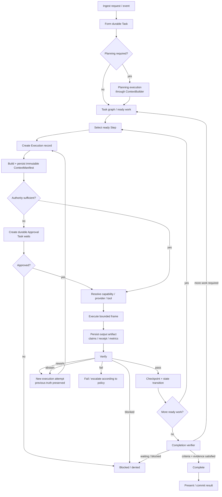
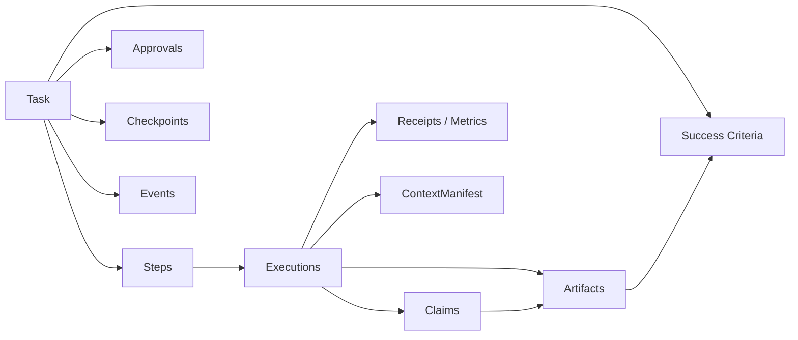
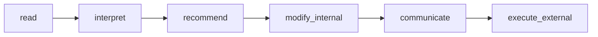
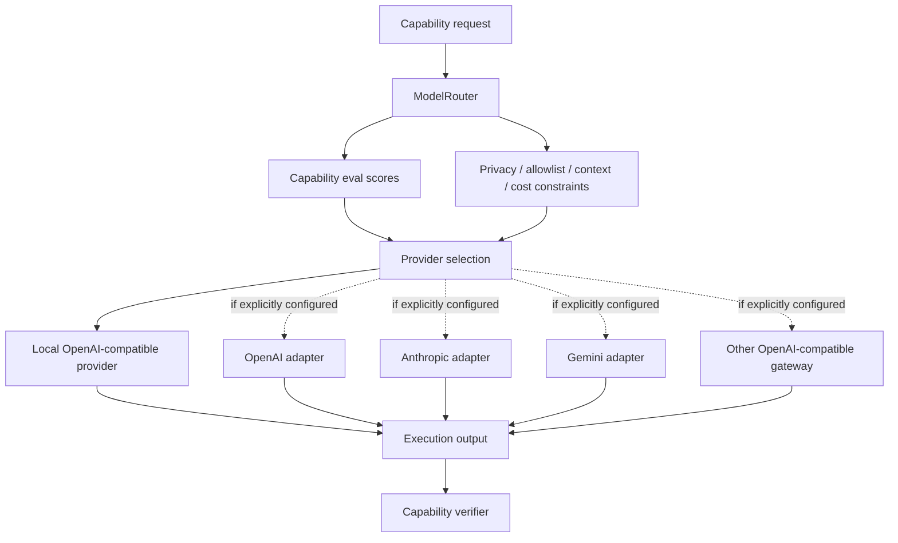
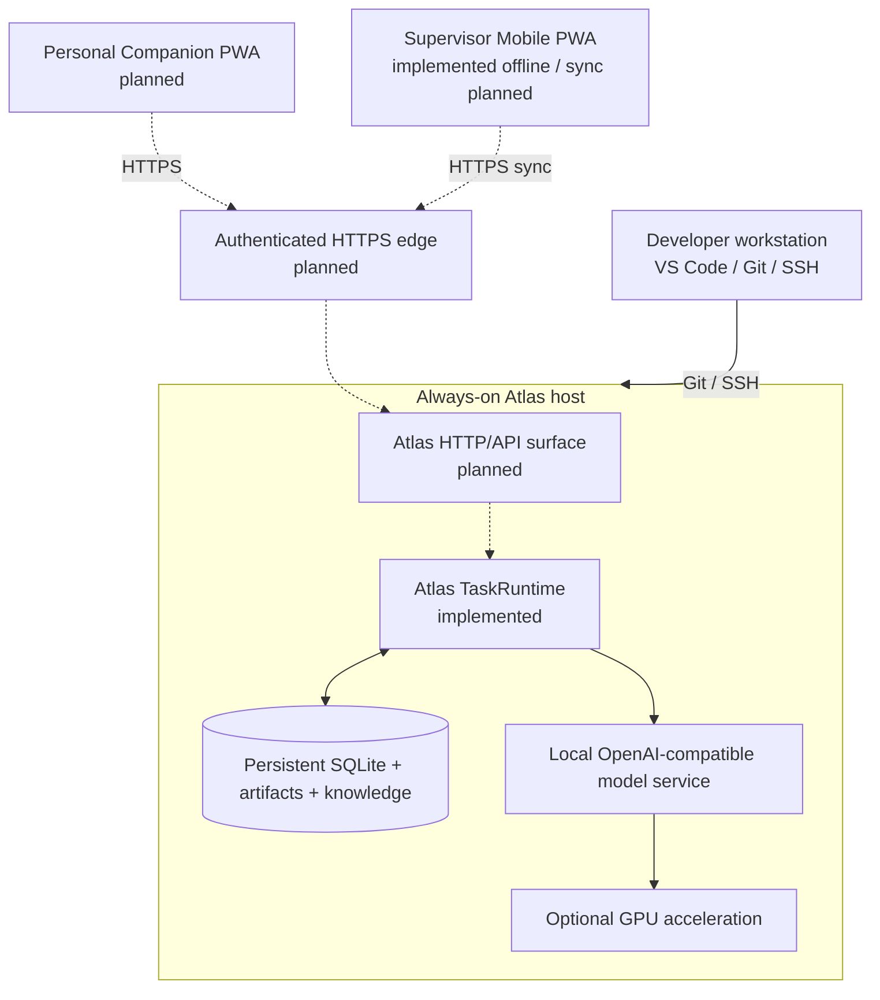

# Atlas 2.0

> **One persistent operational agent. Durable tasks, explicit authority, evidence-backed execution, deterministic work where possible, and model intelligence where it is actually useful.**

Atlas is a local-first operational agent runtime. It is designed to own meaningful work over time rather than behave as a thin chat wrapper around an LLM.

Models, tools, APIs, parsers, retrieval systems, deterministic programs, specialist contexts and external services are **capabilities Atlas may invoke**. They are not separate Atlas identities and they do not own durable operational state.

The runtime owns the objective, task state, evidence, authority, execution history and completion criteria. Conversation is one possible interface into Atlas; it is not the source of truth.

---

## Status

Atlas 2.0 is under active development. The durable task runtime and its core governance contracts are implemented on `main`; several external interfaces and deployment pieces are intentionally still edge work.

| Area | Current state |
|---|---|
| Durable TaskRuntime | **Implemented** |
| SQLite task / step / execution state | **Implemented** |
| Versioned capability contracts | **Implemented** |
| ContextBuilder + immutable ContextManifest | **Implemented** |
| Verification and completion gates | **Implemented** |
| Explicit authority / approvals | **Implemented** |
| Tool Gateway + MCP bridge contract | **Implemented** |
| Local / cloud model provider routing | **Implemented** |
| Provider eval score persistence | **Implemented** |
| SQLite / FTS knowledge plane | **Implemented** |
| Morning Workflow integration | **Implemented** |
| Offline-first Mobile Capture development surface | **Implemented and phone-offline tested** |
| General Atlas browser / Companion PWA | **Not yet implemented** |
| Mobile report server sync + authentication | **Not yet implemented** |
| Production always-on server packaging | **Not yet committed as a canonical deployment** |
| Semantic / vector retrieval | **Deliberately deferred until evals justify it** |

The project deliberately avoids pretending that planned edge integrations already exist.

---

## Core idea

Atlas is built around a simple chain:

```text
Task → Capability → Artifact → Verification
```

A model response is not completion. A tool call is not completion. A conversation ending is not completion.

Atlas completes work when the durable task state and its required evidence satisfy the task's explicit success criteria.

### Architectural invariants

1. **One Atlas.** Specialists are bounded capabilities or contexts, not persistent personas.
2. **Tasks are durable.** Work survives model calls, context limits and process restarts.
3. **Execution depth is not chat/tool-round depth.** Long work is many bounded execution frames.
4. **Deterministic work stays deterministic.** Calculation, filtering, validation, state transitions and known business rules prefer ordinary software.
5. **Capabilities have contracts.** Inputs, outputs, authority, side effects, budgets, retry behaviour and verification are explicit.
6. **Models are providers, not architecture.** Providers can change without changing task semantics.
7. **Context is assembled, not accumulated.** Each execution receives a fresh bounded projection of durable state.
8. **State lives outside the model context.**
9. **Evidence and derived claims remain distinguishable.**
10. **Verification precedes completion.**
11. **Authority is explicit.** Capability does not imply permission.
12. **Learning is proposed, not silently installed.**
13. **Complex infrastructure must earn its place through real work.**

The full design philosophy lives in [Atlas Constitution](./Atlas%20Constitution.md).

---

# System topology

The following diagram represents the current Atlas 2.0 architectural topology. Dashed paths mark external surfaces that are planned or intentionally injected at the edge rather than pretending to be complete today.



### What the topology means

- **The runtime owns the task**, not the resident model.
- **Capabilities sit below task semantics.** A task can route to deterministic code, a tool, a model, a composite workflow or a human gate.
- **The model router sits below capabilities.** A capability may be satisfied by different providers without changing the task contract.
- **State is structural and durable.** The context window is a workspace, not a database.
- **Mobile is an interface, not another agent.** The current capture surface works locally/offline; server sync is a separate future boundary.
- **MCP is an edge protocol, not Atlas's internal ontology.**

---

# Runtime lifecycle

Atlas executes substantive work as a durable graph of bounded frames.



## Execution truth

A concrete execution ends in one of:

```text
pass | rework | abstain | fail | blocked
```

A retry creates a **new execution record**. Atlas does not rewrite a failed attempt into a successful one.

Interrupted idempotent work can be explicitly recovered. Interrupted non-idempotent side effects fail closed because external state may be unknown.

This is why Atlas can execute deeply without depending on an arbitrary conversational `max_tool_rounds` ceiling.

---

# Durable object model



### Task

The durable owner of meaningful work: objective, criteria, constraints, authority, status, steps, evidence and history.

### Step

A bounded unit of work with dependencies, a desired capability, explicit inputs and criterion mapping.

### Execution

One concrete attempt to satisfy a step. It records the exact capability version and concrete provider/tool used.

### Artifact

Immutable task input or output with SHA-256 identity and provenance metadata.

### Claim

A durable statement classified as:

```text
observed | retrieved | calculated | inferred | suggested | executed
```

Observed, retrieved, calculated and executed claims require evidence references.

### Approval

A durable per-action authority decision. Approval can unblock one bounded action without globally elevating Atlas authority.

### ContextManifest

Every normal capability/model invocation receives a manifest built by `ContextBuilder` and persisted **before invocation**. It is immutable for that execution and records the exact bounded projection Atlas supplied, including included/dropped candidates and token accounting.

---

# Capability and tool governance

Every executable responsibility is described by a versioned `CapabilitySpec` rather than by a free-floating prompt or named agent.

A capability may declare:

- stable ID and SemVer version;
- bounded objective and description;
- input/output schemas;
- allowed tools;
- authority requirement;
- side-effect classification;
- idempotency and retry policy;
- context profile and `ContextPolicy`;
- eligible providers and privacy constraints;
- verifier;
- execution/tool/cost budgets;
- deprecation and replacement metadata.

Planned steps may pin an exact capability version. Every execution records the exact version actually used.

`ToolDescriptor` provides the equivalent least-privilege contract for native, API, CLI and MCP tool surfaces. Credentials are not stored in descriptors.

---

# Authority model

Capability and permission are separate concerns.



A task carries an authority scope. A capability declares the authority it requires. If the task does not have sufficient authority, Atlas creates a durable approval request and waits rather than silently escalating itself.

Non-idempotent external side effects are not automatically retried merely because a model or verifier requests rework.

---

# Model/provider topology

Models are providers underneath capabilities.



Routing may consider capability competence, persisted eval scores, privacy, provider allowlists, context capacity, priority, latency and cost constraints.

The example provider registry is [`config/runtime-providers.example.json`](./config/runtime-providers.example.json). It enables only the local resident provider by default. Cloud providers remain disabled until the operator deliberately configures credentials and provider/model details.

Provider/model identities are configuration, not business logic.

---

# Local knowledge

Atlas currently uses a SQLite-first knowledge plane.

`knowledge.ingest_text`:

- chunks extracted UTF-8 text;
- stores document/chunk hashes;
- preserves source provenance;
- records the work through the normal task/artifact/claim runtime.

`knowledge.search`:

- uses FTS5 where available;
- falls back to deterministic SQLite search;
- returns source-grounded chunks through the same capability boundary.

A vector database is intentionally **not** required by the current responsibilities. Semantic/vector retrieval can later implement the same retrieval contract if measured retrieval evals show that FTS is insufficient.

---

# Existing vertical responsibilities

## Morning Workflow

The existing Morning Workflow remains a deterministic responsibility and is exposed through the runtime as:

```text
operations.morning_pack.generate
```

Atlas 2.0 wraps the responsibility through the capability/task boundary without rewriting the frozen parser or changing its behavioural contract.

Relevant documents:

- [Morning Workflow — Behavioural Specification](./Atlas%20Morning%20Workflow%20—%20Behavioural%20Specification.md)
- [Morning Workflow — Implementation Plan](./Atlas%20Morning%20Workflow%20—%20Implementation%20Plan.md)

## Mobile Capture

`atlas_mobile/` contains the offline-first mobile reporting development surface:

- activity-at-a-time capture;
- deterministic green/orange/red validation;
- IndexedDB persistence;
- service-worker application shell caching;
- End Report assembly;
- WhatsApp-ready plain-text rendering and copy;
- offline reopen/persistence behaviour.

The current phone-offline acceptance cycle is recorded in [`atlas_mobile/PHONE-OFFLINE-ACCEPTANCE.md`](./atlas_mobile/PHONE-OFFLINE-ACCEPTANCE.md).

The current implementation does **not** yet provide authenticated synchronization into the Atlas server runtime. Sync remains an explicit edge responsibility rather than being faked inside the offline capture code.

---

# Current repository layout

```text
atlas-agent/
├── atlas_core/
│   ├── tasks/          durable task/step/execution/artifact/claim/approval/event state
│   ├── capabilities/   CapabilitySpec contracts + version-aware registry
│   ├── providers/      provider contracts, routing, adapters and eval scores
│   ├── knowledge/      SQLite / FTS ingestion and retrieval
│   ├── integrations/   adapters around existing responsibilities
│   ├── authority.py    authority ladder and decisions
│   ├── context.py      bounded context assembly + ContextManifest
│   ├── runtime.py      task execution engine + interrupted-frame recovery
│   ├── verification.py
│   ├── planner.py
│   ├── presentation.py
│   ├── tools.py        normalized tool gateway + MCP bridge
│   ├── evals.py
│   ├── events.py
│   ├── bootstrap.py
│   └── __main__.py     CLI
│
├── atlas_morning/      frozen Morning Workflow implementation
├── atlas_mobile/       offline-first mobile capture surface
├── config/             example runtime provider configuration
├── docs/architecture/  governance reconciliation + advisory material
├── tests/              runtime and behavioural regression coverage
└── .github/workflows/  CI
```

---

# Quick start

## Requirements

- Python **3.12**
- Git
- Node.js only if you want to run the Mobile fixture suite
- Optional: an OpenAI-compatible local model endpoint for planning/model capabilities

The CI environment does not install a Python dependency bundle before running the current regression suite.

## Clone

```bash
git clone https://github.com/Keeladin/atlas-agent.git
cd atlas-agent
```

## Python environment

```bash
python3.12 -m venv .venv
source .venv/bin/activate
python --version
```

## Validate the checkout

```bash
python -W error::ResourceWarning -m unittest discover -s tests -q
python -m compileall -q atlas_core atlas_morning tests
node atlas_mobile/run_fixtures.js
```

These are the same classes of checks run by GitHub Actions on `main` and pull requests.

## Initialize a runtime database

```bash
mkdir -p instance
python -m atlas_core --db instance/atlas.db tasks
```

The runtime initializes its durable SQLite stores when assembled.

---

# CLI

The current CLI is the canonical engineering interface into the runtime while a general browser interface is still pending.

```text
python -m atlas_core [--db PATH] [--providers CONFIG] COMMAND
```

Available commands:

```text
morning      Run the existing Morning Workflow through TaskRuntime
plan         Create a durable task and bounded capability plan
run          Run or resume a durable task
recover      Resolve executions left running by an interrupted process
approve      Approve one pending authority gate
deny         Deny one pending authority gate
result       Render durable task truth as a user-facing report
index-text   Index a UTF-8 text file into local knowledge
search       Search local full-text knowledge
cancel       Cancel a non-terminal task
status       Show a task snapshot
tasks        List durable tasks
```

### Index local knowledge

```bash
python -m atlas_core \
  --db instance/atlas.db \
  index-text "Atlas Constitution.md"
```

Then search it:

```bash
python -m atlas_core \
  --db instance/atlas.db \
  search "What is Atlas?"
```

### Configure a local model provider

```bash
cp config/runtime-providers.example.json config/runtime-providers.local.json
```

The example local resident provider expects an OpenAI-compatible endpoint at:

```text
http://127.0.0.1:1234
```

with model identifier:

```text
atlas
```

Verify your model service independently, for example:

```bash
curl http://127.0.0.1:1234/v1/models
```

### Create a planned task

```bash
python -m atlas_core \
  --db instance/atlas.db \
  --providers config/runtime-providers.local.json \
  plan "Explain the purpose of Atlas's durable task runtime" \
  --criterion "Produce a clear evidence-grounded explanation"
```

Then inspect and run the durable task:

```bash
python -m atlas_core --db instance/atlas.db status <TASK_ID>

python -m atlas_core \
  --db instance/atlas.db \
  --providers config/runtime-providers.local.json \
  run <TASK_ID>

python -m atlas_core --db instance/atlas.db result <TASK_ID>
```

---

# Validation and CI

The GitHub Actions workflow currently performs:

```bash
python -W error::ResourceWarning -m unittest discover -s tests -q
python -m compileall -q atlas_core atlas_morning tests
node atlas_mobile/run_fixtures.js
```

Architectural regression requirements include:

- durable state survives database reopen;
- dependency graphs control readiness;
- artifacts remain immutable and hashed;
- execution history is not rewritten by retries;
- authority can pause and resume one bounded action;
- capability version pinning survives durable execution;
- ContextManifest exists before provider/handler invocation;
- ContextManifest cannot be overwritten for an execution;
- bounded context records dropped candidates and reasons;
- tool/capability schemas are enforced;
- side-effect constraints fail closed;
- planning uses ContextBuilder;
- provider routing respects privacy and eval score;
- tasks can execute beyond a shallow conversational tool-round ceiling;
- Morning and Mobile behavioural suites remain green.

---

# Deliberate non-goals

Atlas 2.0 is intentionally **not** built around:

- a collection of persistent named autonomous agents;
- a giant system prompt that carries operational truth;
- a permanent fixed Reasoning Mesh;
- model-specific business logic;
- a vector database before retrieval evals justify one;
- Kafka, Kubernetes, microservices or workflow infrastructure added speculatively;
- Temporal or Celery merely to claim durable execution depth;
- silent self-learning rules;
- automatic high-consequence authority;
- a web UI that defines runtime truth.

The project prefers the smallest system that reliably owns a real responsibility.

---

# Near-term deployment direction

The current runtime is deliberately interface-agnostic. A likely always-on deployment can place the same core behind browser/mobile interfaces without changing task semantics.

**This is deployment direction, not a claim that these server/API components are already implemented in `main`.**



The intended property is simple: **the operational Atlas runtime can remain alive even when the development workstation is off.**

---

# Architecture documents and precedence

When documents disagree, use this order:

1. [Atlas Constitution](./Atlas%20Constitution.md)
2. [Atlas Architecture — Runtime and Topology](./Atlas%20Architecture%20—%20Runtime%20and%20Topology.md)
3. [Atlas Runtime Governance Reconciliation](./docs/architecture/Atlas%20Runtime%20Governance%20Reconciliation.md)
4. Advisory source documents

Additional product/domain references:

- [Atlas Product Definition](./Atlas%20Product%20Definition.md)
- [Atlas Product Direction](./Atlas%20Product%20Direction.md)
- [Mobile Capture V1 — Behavioural Contract](./Mobile%20Capture%20V1%20—%20Behavioural%20Contract.md)
- [Mobile functionality](./Mobile%20functionality.md)

---

# North star

> **Atlas is a local-first persistent operational agent whose durable runtime owns objectives, state, evidence, authority and completion, and dynamically assembles deterministic capabilities, tools and benchmarked local or cloud intelligence into bounded verified execution frames.**

The resident model is not Atlas.

The cloud expert is not Atlas.

The Morning Workflow is not Atlas.

The mobile app is not Atlas.

**Atlas is the persistent system that owns the work and composes those capabilities to remove recurring friction.**
